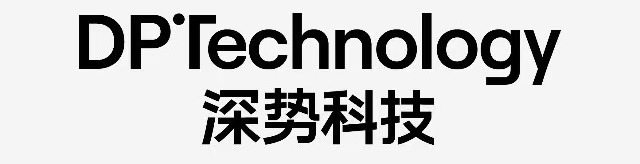
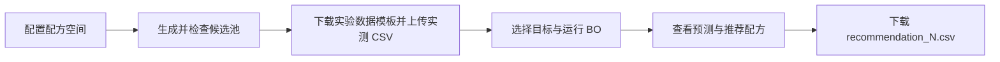

# 电解液配方空间与主动学习平台：前后端设计方案（第二版）

## 1. 目标与范围

建设一个简洁的网页工作台：用户输入锂盐、溶剂及其质量分数范围和实验温度，生成可追溯的候选配方空间；按规定的候选池格式上传已有实验结果；选择单目标或双目标优化；查看并下载算法推荐配方。本方案定义页面、API、数据契约和新撒点脚本的接入方式。

**当前原型已实现：**网页与本地 API 位于 `web/`，撒点脚本位于 `pool/generate_pool.py`。由于本地 `botorch` 环境已经包含 Flask，首版使用 Flask 服务；React/TypeScript 与 FastAPI 仍可作为后续部署时的技术选项。原型运行数据写入 `bo_test/`，启动和验证方式见 `web/README.md`。

页面视觉参考 [Molecular Universe 的电解液设计页](https://molecular-universe.com/design/electrolyte/create)：白色背景、简洁导航、按步骤分组的卡片、清楚的字段标签和主要操作按钮。左上角使用用户提供的 DPTechnology／深势科技图片作为品牌 Logo，资源文件为 [assets/dptechnology-logo.jpg](assets/dptechnology-logo.jpg)，显示时按原比例缩放，替代文字占位 Logo；页面其余部分沿用简约风格，不复制参考站点的品牌元素。



首版采用**每个设计任务一个固定温度**。温度只写入设计配置与界面记录，暂不作为 BO 特征。撒点、候选池转换、实验数据读取、单／双目标训练与推荐继续沿用目前七元电解液已跑通的文件流转方式。

## 2. 用户流程与页面



| 页面/区域 | 主要控件 | 用户可见结果 |
| --- | --- | --- |
| 顶部导航 | 左上角 DPTechnology／深势科技图片 Logo；右侧简短的工作流导航 | 显示当前设计名称和步骤 |
| ① 配方空间 | 设计名称；锂盐名称与 SMILES；固定温度 °C；锂盐总质量分数范围；可增删的溶剂行（名称、SMILES、溶剂池质量分数下限/上限），其中一项标记为基准溶剂；采样数和随机种子置于“高级设置” | 实时校验、溶剂分数合计可行性、提交生成 |
| ② 候选池 | 生成状态、候选数、约束筛选数；按 `sample_id` 分页的配方表；质量分数/摩尔分数切换；搜索和导出 | `pool_catalog.csv` 下载链接及设计配置下载链接 |
| ③ 实验数据 | 从候选池下载规定格式模板、上传完整实验 CSV、校验报告 | 匹配/缺失/重复/无效行数，已测目标覆盖情况 |
| ④ 优化设置 | 单目标/双目标切换；目标列和单位；最大化/最小化；每轮推荐数；高级 GP 参数 | 开始运行、任务状态、错误说明 |
| ⑤ 推荐结果 | 本轮编号、原始配方字段、空白目标列、候选预测均值/不确定度的单独视图 | 表格预览及 `recommendation_N.csv` 下载 |

交互原则：一次只突出一个主操作；候选表默认折叠长 SMILES；数值输入同时显示单位；后台生成和训练使用异步任务及进度状态，不让浏览器一直等待 HTTP 响应。

## 3. 配方空间数据契约

前端传给后端的规范化请求示例（百分数在 UI 显示为 wt%，API 传 0–1 分数）：

```json
{
  "name": "amide-electrolyte-25C",
  "temperature_C": 25,
  "batch_mass_g": 5.0,
  "mass_step_g": 0.0001,
  "salt": {
    "name": "LiDFOB",
    "smiles": "F[B-]1(OC(C(O1)=O)=O)F.[Li+]",
    "final_mass_fraction_bounds": [0.10, 0.30]
  },
  "solvents": [
    {"name": "NDFA", "smiles": "CN(C)C(=O)C(F)(F)F", "balance": true, "pool_mass_fraction_bounds": [0.50, 1.00]},
    {"name": "TTE", "smiles": "FC(F)(OCC(F)(F)C(F)F)C(F)F", "pool_mass_fraction_bounds": [0.00, 0.50]}
  ],
  "sampling": {"candidate_power": 14, "seed": 20260929}
}
```

约定：锂盐范围以**最终电解液总质量**为分母；各溶剂范围以**除锂盐以外的溶剂池质量**为分母。对每个生成点，先取锂盐质量分数 `s`，再取各溶剂池分数 `q_i`，要求 `Σq_i=1` 且各 `q_i` 落在用户输入的区间内；最终电解液分数为锂盐 `s`、各溶剂 `(1-s)q_i`，总和也为 1。后端检查各区间为 `[0,1]` 内有序数值、`Σ下限 ≤ 1 ≤ Σ上限`、恰好一个基准溶剂、SMILES 可解析、名称唯一、质量步长可称量。锂盐用量范围必须提供；首版不加入摩尔浓度、密度或其他化学约束。

## 4. 后端服务与文件流转

建议采用 React/TypeScript 前端与 FastAPI 后端。API 层负责请求校验、任务管理、固定实验 CSV 格式校验和结果预览；算法层继续使用现有 `convert_pool.py`、`qLogNEI.py`、`qLogNEHVI.py`，并新增一个面向 UI 配方空间的撒点脚本。以 `design_id` 和 `run_id` 隔离文件，所有输出写入服务端配置的工作根目录，前端只接收文件 ID/下载 URL，不提交任意本机路径。

```text
设计请求
  → 新撒点脚本 generate_pool.py：校验配置与 SMILES
  → config_snapshot.json + components.csv
  → Sobol 撒点：锂盐分数 s；有界溶剂池分数 q_i 且 Σq_i=1
  → 质量称量离散、复核范围、去重
  → feasible_candidates.csv + pool.csv（完整可行候选空间）
  → convert_pool.py
  → pool_catalog.csv + pool_features.csv + pool_manifest.json
  → 实验 CSV 导入/规范化为 experiment.csv
  → qLogNEI.py 或 qLogNEHVI.py
  → candidate_predictions*.csv + recommendation_*.csv + observation.csv
```

七元配方相关文件目前位于 `/Users/zilinchen/Documents/ChatGPT/No_anode/AFLMB-AL/data/DoE/seven_component/`。首版在此目录下建立 `ui_runs/<design_id>/`，写入 `config_snapshot.json`、`components.csv`、`feasible_candidates.csv`、`pool.csv`，避免覆盖已有七元实验文件。转换与 BO 结果存于同一任务的 `converted/`、`optimization/<run_id>/` 子目录。这里沿用现有七元流程的**文件格式和执行顺序**，新撒点脚本不把组分数或名称写死。

### 4.1 新撒点脚本的最小实现契约

建议新增 `pool/generate_pool.py`，输入为设计 JSON 和输出目录，输出与当前七元 DoE 的表头兼容，不增加复杂的专属化学约束：

1. 读取一个锂盐和多个溶剂，使用 RDKit 校验并规范化 SMILES，计算分子量；输出带组分顺序的 `components.csv` 和不可变的 `config_snapshot.json`。一个锂盐标为 `primary_salt`，一个指定的基准溶剂标为 `balance_solvent`，其余标为 `cosolvent`，以适配转换脚本。
2. 使用固定种子的 Sobol 序列采样 `s` 和溶剂池分数。溶剂分数必须严格满足 `Σq_i=1`，并满足每个溶剂自身的上下限。可采用逐项剩余额度法：为当前溶剂计算不破坏剩余组分上下限的可行区间，再用 Sobol 数值在该区间采样；最后一个溶剂取剩余分数。不能先独立采样再简单归一化，因为那样可能越过原定上下限。
3. 计算各组分最终质量分数 `w_s=s`、`w_i=(1-s)q_i`；按 `batch_mass_g` 与 `mass_step_g` 离散成可称量质量，再以离散后的值重算质量分数与摩尔分数。复核溶剂池范围及总质量，删除不合格和质量向量重复的点。
4. 输出 `feasible_candidates.csv` 和供转换脚本读取的 `pool.csv`。每行至少包括 `presence_pattern`，以及对每个组分的 `<name>_mass_g`、`<name>_mass_fraction`、`<name>_mole_fraction`。`pool.csv` 可与 `feasible_candidates.csv` 使用相同内容。温度只保存在 JSON 与 UI 任务元数据中。

输入为一个主锂盐、若干溶剂和可选添加剂。添加剂角色为 `functional_additive`（如 VC、TMSP）或 `salt_additive`（如 LiNO3），其范围与锂盐一样以电解液总质量为分母；溶剂分享扣除盐与添加剂后的质量，即 `w_i=(1-s-Σa)q_i`。

`convert_pool.py` 要求配置中的每个组分有 `name`、受支持的 `role`、`smiles`；池表必须有 `presence_pattern`，以及每个组分的 `<name>_mass_g`、`<name>_mass_fraction`、`<name>_mole_fraction`。输出 `pool_catalog.csv` 含 `sample_id`、化学组 ID、各组分的 `compound_i`、`smiles_i`、`mass_ratio_i`、`mole_ratio_i`。转换时建议明确传 `--pool`、`--config`、`--output-dir`；`--feature-basis mass` 与 BO 当前默认质量分数特征一致。`pool_catalog.csv` 同时保留两套比例，所以以后仍可选择摩尔分数训练。

**现有代码的接入边界：**`seven_component_amide_design.py` 写死了七个名称和特定约束，不能直接读取前端的任意溶剂列表。因此新建上述最小撒点脚本；原七元脚本继续作为已跑通流程与输出格式的参照。撒点得到的是候选配方，**不视为已测实验结果**。

## 5. 实验数据上传与目标映射

**上传契约固定为“`pool_catalog.csv` 原有全部列 + 本次所选目标性能列”**。界面先从当前候选池生成 `experiment_template.csv` 供下载，用户只保留已做实验的配方行，在末尾填写对应性能值后上传。首版不接收仅含 `sample_id` 和目标值的简表，也不接受前端任意改名的配方列。示意表头如下；`…` 表示模板会完整保留实际候选池中的其余字段，而不是文件中的文字：

```text
sample_id,chem_group_id,solvents,lithium_salts,...,
compound_0,smiles_0,mass_ratio_0,mole_ratio_0,...,Conductivity,LCE
```

后端按 `sample_id` 与本设计的候选池逐行匹配，检查唯一性、所有原始配方字段及比例值与 `pool_catalog.csv` 一致、目标值为有限数值或留空、不能有池外样本。校验通过后保存为该优化运行的 `experiment.csv`；校验失败则逐行报告，不启动 BO。双目标训练只使用两个目标都完整的行；未测或部分实测行留在候选池。上传后的原始文件与规范化结果都应保留以便追溯。

现有 BO 代码要求每条已测配方也在候选池中，因此**历史实验若不在当前候选池，不能仅靠改 CSV 列名导入**。模板上传路径仍对池外样本报错；另设“自有配方”路径（`pool/import_experiments.py`）：实验人员按组分填写实际称量质量，脚本把与候选池相同的配方对应到原行，把新配方作为固定候选追加到 `pool.csv` 并用原设置重新转换，再生成 `experiment.csv` 和 `experiment_mapping.csv`。`sample_id`、`chem_group_id` 是组成的确定性哈希，所以新旧候选编号一致，原有编号不变；不做最近邻替代或自动修改实测配方。重复配方的目标值取平均，越界配方保留并标记。

目标名称拆成“界面显示名、单位、内部列名”三项，避免把单位或简称当作另一个指标：

| 界面显示 | 单位 | 建议内部列名 | 说明 |
| --- | --- | --- | --- |
| Conductivity | mS/cm | `Conductivity` | 界面显示 `Conductivity (mS/cm)`，下载模板及上传 CSV 固定使用 `Conductivity` |
| LCE | 由实验定义 | `LCE` | 与当前默认 `logCE` **不自动等同**；下载模板及上传 CSV 固定使用 `LCE` |

单目标配置 `targets=["Conductivity"]`，运行 `qLogNEI.py --target Conductivity`；双目标配置 `targets=["Conductivity","LCE"]`，运行 `qLogNEHVI.py --targets Conductivity LCE`。目标列的顺序与优化方向、参考点顺序一致。若上传的是现有七元示例数据，其目标列为 `logCE` 和 `Conductivity`，界面应按真实列名选择 `logCE`，不可把它静默解释为 `LCE`。内部脚本参数以数组方式传递给子进程，不拼接 shell 命令。

## 6. API 草案

| 方法与路径 | 请求要点 | 响应要点 |
| --- | --- | --- |
| `POST /api/v1/designs` | 第 3 节配方空间 JSON | `design_id`、校验结果、生成任务 ID |
| `GET /api/v1/designs/{id}` | 无 | 状态：`queued/running/succeeded/failed`；数量、错误信息、文件列表 |
| `GET /api/v1/designs/{id}/candidates?page=&size=` | 分页与筛选参数 | 候选总数及当前页配方；不一次返回全池 |
| `GET /api/v1/designs/{id}/files/{name}` | 文件名仅限白名单 | 下载 `config_snapshot.json`、`components.csv`、`pool_catalog.csv` 等 |
| `GET /api/v1/designs/{id}/experiment-template?targets=...` | 所选目标内部列名 | 下载“完整候选池列 + 目标列”的 CSV 模板 |
| `POST /api/v1/designs/{id}/observations` | 按模板填写的完整实验 CSV 与所选目标列 | 导入行数、已匹配行数、错误清单、规范化文件 ID |
| `GET /api/v1/designs/{id}/recipe-template?target=...` | 所选目标内部列名 | 下载“experiment_id + 各组分质量(g) + 目标列”的配方模板 |
| `POST /api/v1/designs/{id}/experiment-recipes` | 按组分填写的自有配方 CSV 与所选目标列 | 实验行数、配方数、已在池/新增/越界/重复合并数、候选池新规模 |
| `POST /api/v1/designs/{id}/optimization-runs` | `mode=single/multi`、目标及方向、批量数、模型参数 | `run_id`、异步任务状态 |
| `GET /api/v1/optimization-runs/{run_id}` | 无 | 当前轮次、训练/预测/推荐状态、产物链接 |
| `GET /api/v1/optimization-runs/{run_id}/recommendations/{round}` | 轮次 | 配方表预览、目标列、CSV 下载链接 |

错误响应统一包含 `code`、`message` 和可选的 `field`/`row`；例如无效 SMILES、区间不可行、上传的 `sample_id` 不在候选池、实验特征与候选池冲突、完整实测少于两条、上一轮推荐尚未填齐。任务重复提交使用幂等键，避免同一设计被并发写入。

## 7. 运行规则与界面回传

1. 新撒点脚本生成符合七元流程文件契约的候选数据，`convert_pool.py` 转换后，后端分页返回 `pool_catalog.csv` 并提供完整 CSV 下载。
2. 用户从候选池下载实验模板，填写已测配方的目标值并上传。后端执行完整列与逐行配方校验；通过后建立独立优化输出目录，调用对应单/双目标脚本，并显式传入 `--experiment`、`--pool`、`--output`、目标列和优化方向。
3. 算法产生 `candidate_predictions.csv`（后续带轮次后缀）与 `recommendation_1.csv`（后续 `recommendation_2.csv` 等）。预测值只展示在预测视图；推荐 CSV 保留原始配方信息和空白性能列，供真实实验回填。
4. 界面显示推荐结果并提供下载。后续真实回传通过推荐 CSV 或上传接口进入 `observation.csv`，再触发下一轮。演示模式可单独调用 `simu_experiment.py` 生成随机目标值，但必须标记为**模拟数据**，与真实实验运行隔离。

## 8. 首版验收标准与待扩展项

- 能创建“一个锂盐 + 多个溶剂”的 5 元或 7 元设计，撒点后的每行溶剂池分数之和为 1，各分数落在输入范围内，并输出与 `convert_pool.py` 兼容的候选文件；重复运行相同输入与种子时，候选内容和 `sample_id` 稳定。
- 页面左上角显示提供的 DPTechnology／深势科技 Logo；能显示候选数量、预览/下载 `pool_catalog.csv`。
- 实验结果必须按下载模板的完整配方列上传；CSV 校验能报告池外 ID、重复样本、配方字段不一致、空值和非法性能值。
- 单目标、双目标分别调用正确脚本；至少两条完整实测数据时，能生成本轮预测和 `recommendation_1.csv`，推荐行来自候选池且性能列为空。
- 不同设计及不同优化运行的文件互不覆盖；任务失败可在界面查看明确原因。
- 多锂盐、目标单位换算、真实实验回填后的多轮 UI 控制均作为后续扩展；首版先完成“创建空间 → 转换候选池 → 按模板上传初始实验 → 产生推荐”。

## 9. 现有实现依据

- DoE 七元专用脚本：`/Users/zilinchen/Documents/ChatGPT/No_anode/AFLMB-AL/seven_component_amide_design.py`；现有配置与产物：`/Users/zilinchen/Documents/ChatGPT/No_anode/AFLMB-AL/data/DoE/seven_component/`；新撒点脚本拟建于 `pool/generate_pool.py`。
- 候选池转换：`pool/convert_pool.py`。
- 单/双目标 BO 与实验数据回流：`qLogNEI.py`、`qLogNEHVI.py`、`bo_utils.py`。
- 模拟回传：`simu_experiment.py`。
